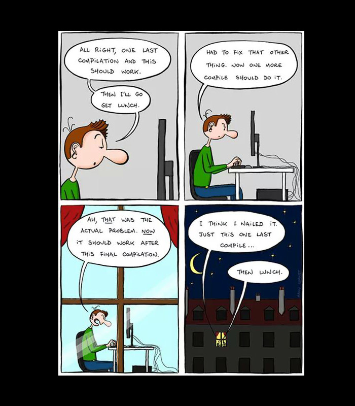
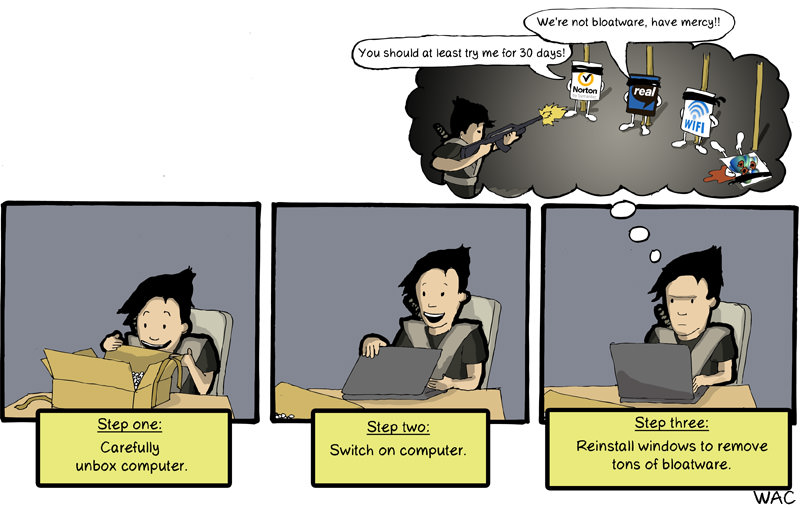
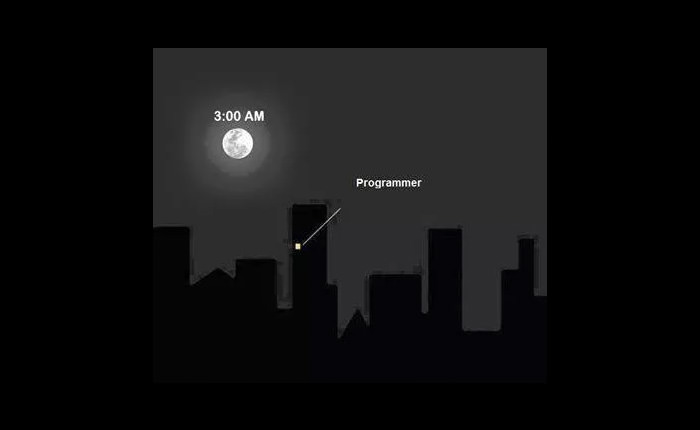
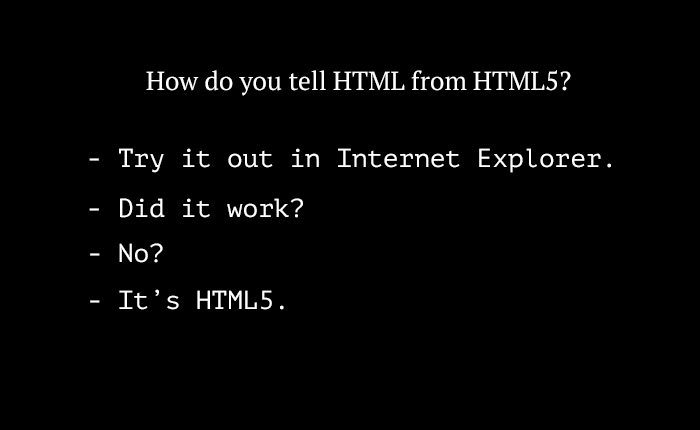
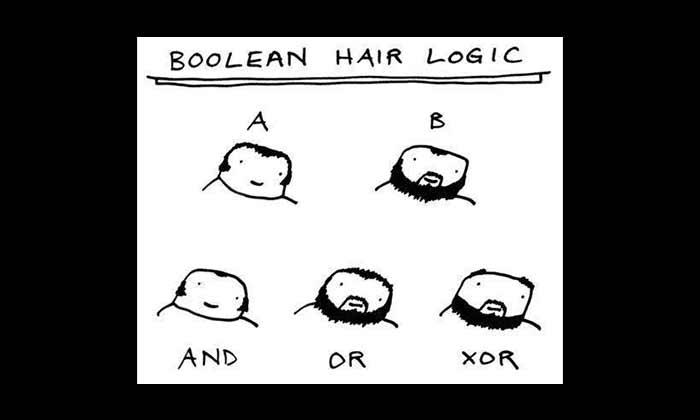
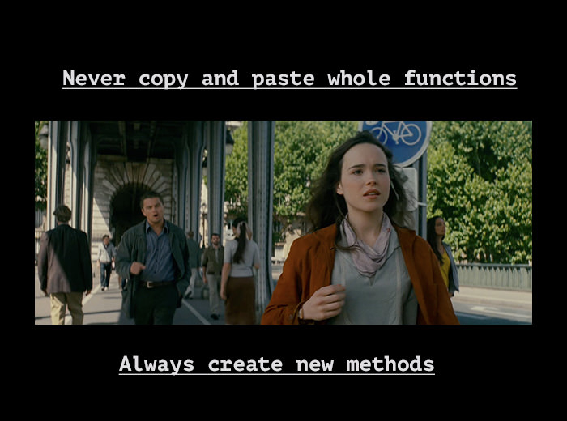
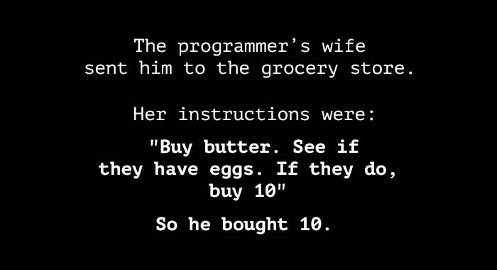

It isn’t easy being a programmer. They code all day, debug all night and go through thousands of code lines trying to clear up all possible messes before going live with their code. Sometimes, it takes a fellow programmer to understand the hardships of another programmer. The same can be said of their jokes. 

<figure class="">
	
	
	
	
	
	
	
	
	
	
	
	
	
	
	
	
	
	
	
	
	
	
	
	
	
	
	
	
	
	
	
	
	
	
	
	
	
	
	
	
	
	
	
	
	
</figure>
