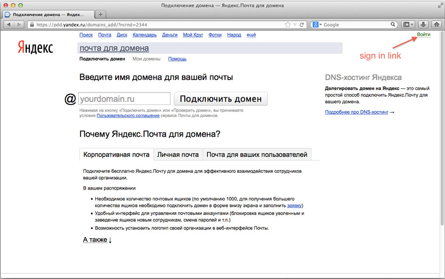
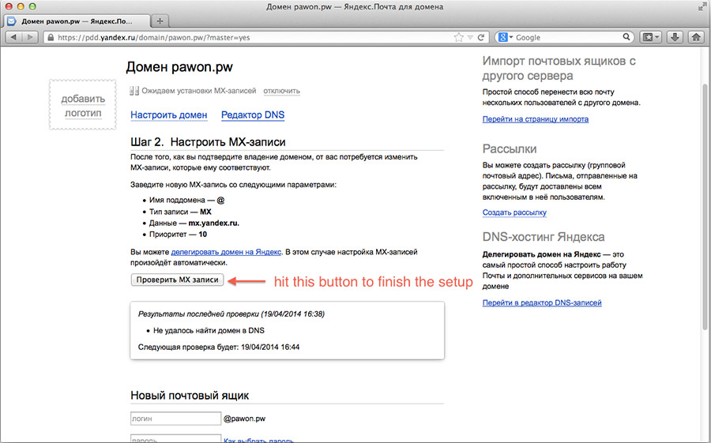

Google has put an end to thier free custom domain email service since a long time ago, and finally [Microsoft will also do the same thing](http://www.pcworld.com/article/2142724/microsoft-ends-free-custom-email-domain-support-for-outlook-com.html). I'm still using Outlook service for my personal custom email, but I think I must migrate to another service that is still free of charge.

There are many email services other than Gmail and Outlook with the same quality, one of them is Yandex.Mail.

Yandex is a Russian based company, many people call it as "the Google of Russia" because it is also a search engine founded in 1997, and it has the same services like maps, mail, translation, cloud storage, and many more. Free email with @yandex.com available in English, but if you want to setup an email with a custom domain, it's available only in Russian. :D

>Yandex offers 1000 email accounts with your own domain for free.

Basically, the custom domain email settings are same on all services, but let me help you to setup your custom email on Yandex.Mail step by step.

## Let's get started!

#### Update 
Yandex has a setup page in English!  Just go to https://domain.yandex.com/domains_add/ and setup your domain in minutes. 🙂 Enjoy!

**1. Create a Yandex account**

   You can register an email account on [http://mail.yandex.com/](http://mail.yandex.com/). It is in English, so it must be easy.

**2. Sign in to Yandex domain admin**

   Go to [https://pdd.yandex.ru/domains_add/](https://pdd.yandex.ru/domains_add/) and sign in with your Yandex account. Tips: just write your username and password, then hit Enter!

<figure>
  
</figure>

**3 . Register your domain**

   Insert your domain and hit **"Подключить домен"** button. It means **"connect domain"**.

<figure>
  
</figure>

**4 . Verify domain ownership**

   You don't need to change the DNS server, I think the fastest way is by adding a CNAME record to your domain. There are two important values in the red boxes.

<figure>
  
</figure>

   Go to the domain admin on your registrar and add the CNAME record, I'm using Namecheap for the example.

<figure>
  
</figure>

**5 . Setup MX record**

   Create a MX record from your domain admin with the following values:

>Host Name: @
>Server: mx.yandex.ru. (ends with dot (.))
>Mail type: MX
>Priority : 10

<figure>
  
 
</figure>

**6 . Create an account on your custom email**

  Yup, one more step and the setup process will be finished. Now you can create an email account with your own domain, you can create up to 1000 account!

<figure>
  
</figure>  

  If you don't get any problem, just go to [https://mail.yandex.com/for/yourdomain.com](https://mail.yandex.com/for/yourdomain.com)

**7 . IMAP , POP3 and SMTP Config**

  Use the following IMAP , POP3 and SMTP config for custom email client:  

  **IMAP**

  >Server: imap.yandex.com
  >Port: 993 with SSL enebled

  **POP3**

  >Server: pop.yandex.com
  >Port: 995 with SSL enebled

  **SMTP**

  >Server: smtp.yandex.com
  >Port: 465 with SSL enabled

**8 . Add New Accounts**

  Just go to [https://pdd.yandex.ru/domain/yourdomain.com/?master=yes](https://pdd.yandex.ru/domain/yourdomain.com/?master=yes) and add accounts.  

<figure>
  
</figure>  