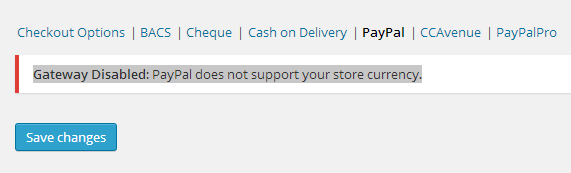

### Gateway Disabled: PayPal does not support your store currency.

When we change the currency to INR as store currency in Woocommerce settings then it will result in an error on woocommerce paypal page like this.



#### Reason

The reason is quite simple because Paypal does not support Indian Currency .

#### Solution

The solution is also quite simple.
First We Have to add INR in Paypal supported currencies . 
Open theme's function.php and add following code.

```Php
add_filter( 'woocommerce_paypal_supported_currencies', 'add_kap_paypal_valid_currency' );
function add_kap_paypal_valid_currency( $currencies ) {
array_push ( $currencies , 'INR' ); /* YOUR CURRENCY */
return $currencies;
}
```

#### The Real Thing 

Paypal still does not support Indian Currency and we can’t also make paypal to support Indian Currency. In simple **words Your online store support INR and payapl doesn’t.. The Hook Is** We have to convert currency changes before redirecting to paypal. To do this got to your theme’s function.php file and add the below code.


```Php
function woocommerce_paypal_args_for_inr($paypal_args){
    if ( $paypal_args['currency_code'] == 'INR'){
 
        $convert_rate = getFromYahoo();
 
        $count = 1;
        while( isset($paypal_args['amount_' . $count]) ){
            $paypal_args['amount_' . $count] = round( $paypal_args['amount_' . $count] / $convert_rate, 2);
            $count++;
        }
        if (isset($paypal_args['tax_cart'])) {
            $paypal_args['tax_cart'] = round($paypal_args['tax_cart'] / $convert_rate, 2);
        }

        if (isset($paypal_args['shipping_1'])) {
            $paypal_args['shipping_1'] = round($paypal_args['shipping_1'] / $convert_rate, 2);
        }
    }
    return $paypal_args;
}

add_filter('woocommerce_paypal_args', 'woocommerce_paypal_args_for_inr');

function getFromYahoo()
{
    $from   = 'USD'; /*change it to your required currencies */
    $to     = 'INR';
    $url = 'http://finance.yahoo.com/d/quotes.csv?e=.csv&f=sl1d1t1&s='. $from . $to .'=X';
    $handle = @fopen($url, 'r');

    if ($handle) {
        $result = fgets($handle, 4096);
        fclose($handle);
    }
    $allData = explode(',',$result);
    return $allData[1];
}
```

#### The Logic

* First we are getting all Paypal arguments before redirecting to Paypal by using “woocommerce_paypal_args” hook.
* After that we are fetching current **INR Rate In USD using Yahoo API.**
* After getting conversion rate we are modifying the Paypal Arguments according to USD value.
* Now all done and returning.

**Note – After redirecting to paypal, customer will see all the prices in USD not in INR.**

#### Manual Excahnge Rate 

Replace $convert_rate value with this 

```
$convert_rate = 55;
```


### Final Code

<a href="https://gist.github.com/vikas5914/a13181b0647c2f911d2e" class="" target="_blank">View on Github</a>


### Fix for Woocommerce 2.3.9 or Above

<span class="alert-box">Validation error: PayPal currencies do not match (code USD). Order status changed from Pending Payment to On Hold.</span>

To remove this error go to **“plugins/woocommerce/includes/gateways/paypal/includes/class-wc-gateway-paypal-ipn-handler.php”** and comment two lines (line number : 177 and 178 ) like this 

```
//$this->validate_currency( $order, $posted['mc_currency'] );
//$this->validate_amount( $order, $posted['mc_gross'] );
```

